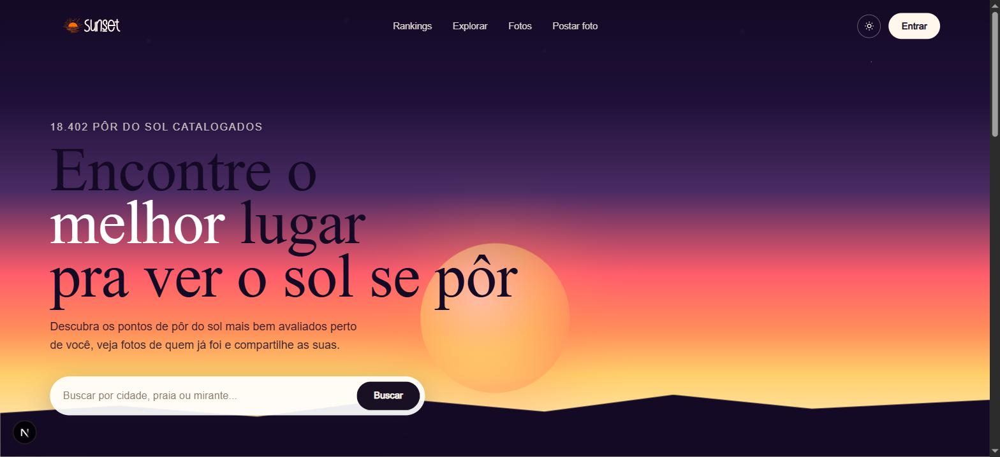
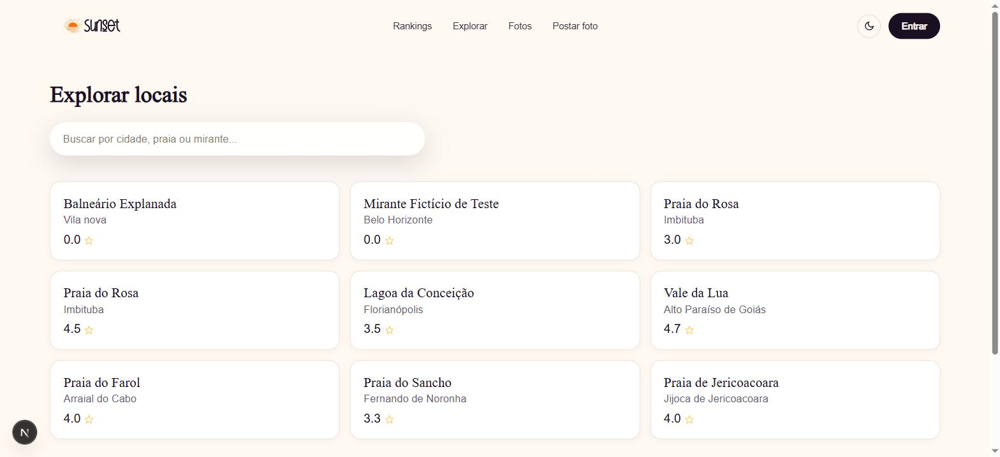
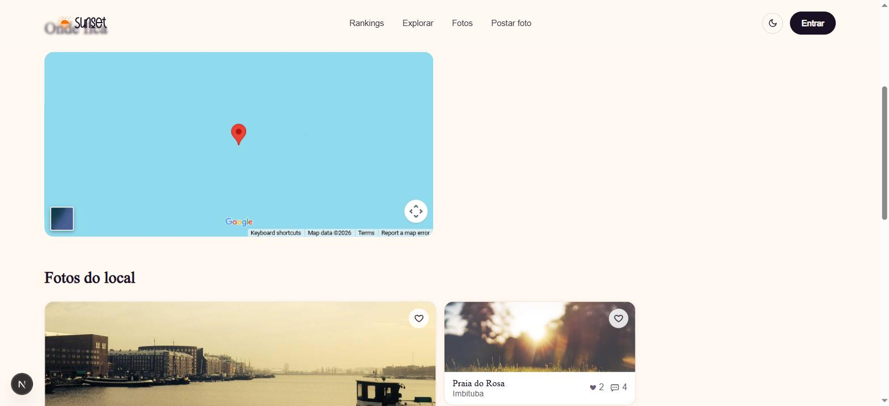
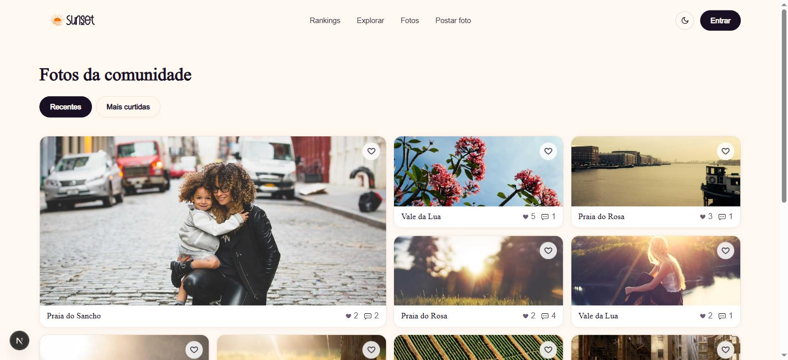
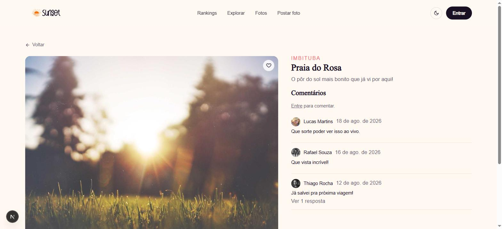
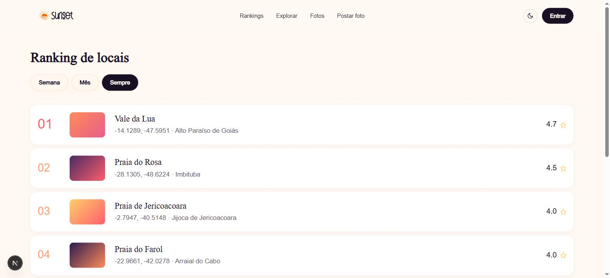
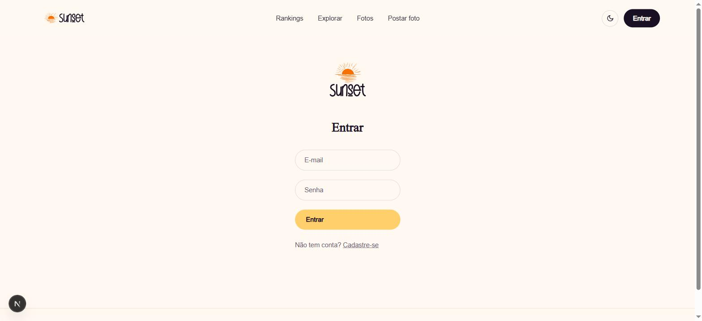

# Sunset

Sunset é uma plataforma onde usuários pesquisam locais com as mais bonitas visões de pôr do sol, postam fotos marcando o local, curtem, comentam e avaliam os locais para gerar rankings.

Este repositório é o **front-end** (Next.js / React), que consome a [Sunset.API](../../dotnet/sunsetapi) (.NET 9).



## Funcionalidades

- **Busca e ranking de locais** — pesquisa por cidade/praia/mirante, detalhe do local com mapa, horário do pôr do sol do dia e fotos associadas; ranking dos locais mais bem avaliados por semana, mês ou desde sempre.
- **Feed de fotos** — galeria da comunidade ordenável por recentes ou mais curtidas, com paginação por cursor ("carregar mais").
- **Postagem de fotos** — upload de imagem (com recorte) via URL pré-assinada direto pro storage, associando a um local (com deduplicação).
- **Interação social** — curtidas, comentários (com respostas) e avaliação (1–5) por local.
- **Contas de usuário** — cadastro/login com consentimento explícito aos Termos de Uso, perfil com avatar, exclusão de conta (anonimização) e exportação de dados, conforme a LGPD.
- **Moderação** — fila de denúncias, remoção de conteúdo, histórico de ações de moderação, gestão de papéis de usuário e edição dos documentos legais (Termos/Privacidade), restrita a Moderadores/Admins.
- **Tema claro/escuro** com persistência da preferência do usuário.

## Capturas de tela

| | |
|---|---|
| **Locais** — busca e listagem | **Detalhe do local** — mapa, horário do pôr do sol e fotos |
|  |  |
| **Feed de fotos** da comunidade | **Detalhe da foto** com comentários |
|  |  |
| **Ranking** de locais | **Login** |
|  |  |

## Stack

- [Next.js](https://nextjs.org) (App Router) + React + TypeScript
- Tailwind CSS
- Fetch wrappers próprios em `lib/api/` (sem client HTTP pesado por padrão)

## Estrutura de pastas

```
app/
├── layout.tsx
├── page.tsx                 # home (hero + ranking + galeria)
├── locations/
│   ├── page.tsx              # busca/lista de locais
│   └── [id]/page.tsx         # detalhe do local
├── photos/[id]/page.tsx      # detalhe da foto (comentários)
├── ranking/page.tsx
├── upload/page.tsx           # postar nova foto
├── profile/[id]/page.tsx
├── moderation/page.tsx       # painel de moderação (Moderador/Admin)
├── termos/page.tsx
├── privacidade/page.tsx
└── (auth)/
    ├── login/page.tsx
    └── register/page.tsx
components/
├── ui/                       # Button, SearchBar, Tabs — genéricos, sem lógica de negócio
├── location/                 # LocationCard, RankingList, LocationMap
├── photo/                    # PhotoGrid, PhotoCard, LikeButton, CommentList
├── moderation/                # ReportsQueue, ModerationHistory, LegalDocumentEditor, UserRoleManager
└── layout/                   # Navbar, Footer
lib/
├── api/                      # locations.ts, photos.ts, auth.ts, moderation.ts — chamadas HTTP
├── hooks/                    # useAuth, useLikePhoto, useComments
└── utils/                    # formatDate, geolocation
types/                        # location.ts, photo.ts, user.ts, comment.ts, report.ts
```

Rotas em `app/` refletem 1:1 os recursos da API. Toda chamada HTTP passa por `lib/api/` — nenhum componente chama `fetch` direto pra API. Tipos em `types/` espelham as entidades da API.

## Rodando localmente

### Pré-requisitos

- Node.js 20+
- A [Sunset.API](../../dotnet/sunsetapi) rodando localmente (veja o README daquele repositório) — o front-end depende dela para qualquer dado real.

### Configuração

Crie um `.env.local` na raiz com:

```bash
NEXT_PUBLIC_API_URL=http://localhost:5256/api/v1
NEXT_PUBLIC_GOOGLE_MAPS_API_KEY=<sua-chave-da-google-maps-embed-api>
```

### Comandos

```bash
npm install
npm run dev     # servidor de desenvolvimento (Next.js, Turbopack) em http://localhost:3000
npm run build   # build de produção
npm run start   # serve o build de produção
npm run lint    # ESLint
```

## Decisões de design

- **SSR/SSG**: páginas de local e de foto (`locations/[id]`, `photos/[id]`) são renderizadas no servidor — são a porta de entrada de SEO (busca orgânica por "pôr do sol em X").
- **Upload de imagem**: pede-se uma URL pré-assinada à API, sobe-se o arquivo direto pro storage a partir do client, e só então envia-se `POST /photos` com a URL resultante — nunca o binário pra própria API.
- **Paginação**: feeds (`/photos`, listagem de `/locations`, histórico de moderação) usam cursor — a UI de "carregar mais" guarda e reenvia o cursor, não um número de página.
- **Estado de curtida**: otimista na UI (marca como curtido imediatamente ao clicar) com rollback se a chamada falhar.
